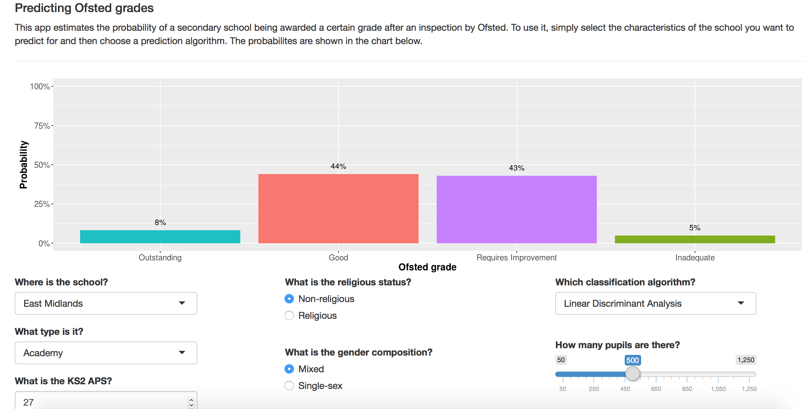
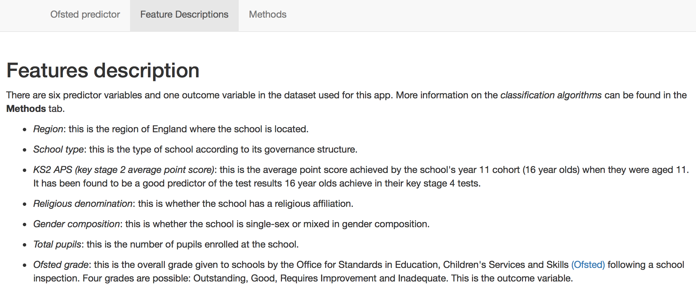
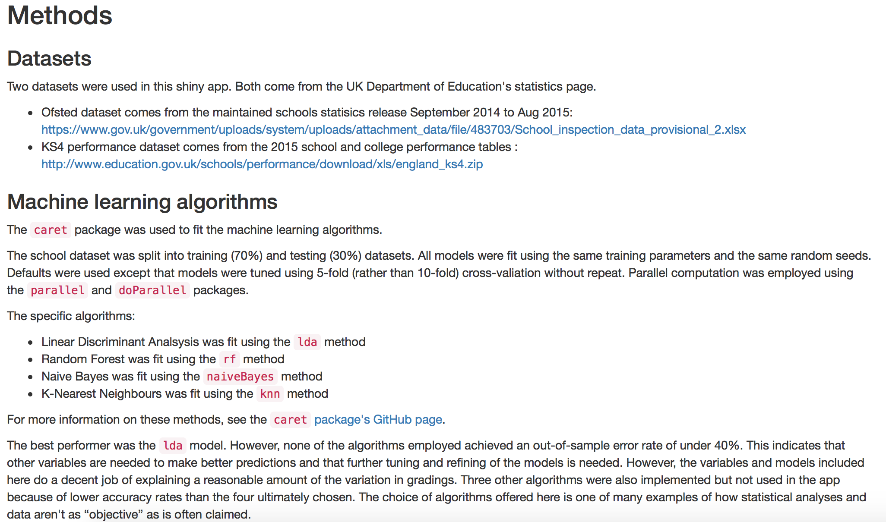

## User Interface

---

## User inpus and tabs

### User inputs

- Region (dropdown)
- School type (dropdown)
- Average test score of the cohort at age 11 (numeric entry)
- Religious status of the school (radio button)
- Gender composition of the school (radio button)
- Classification algorithm (dropdown)
- Number of pupils in the school (slider)

### Tabs
1. The app itself
2. Feature descriptions - so the user can understand the features in the model
3. Methods - so the user can understand how the algorithms were fitted and where the data came from

---

## Feature descriptions and methods
One tab shows a **description** of the features (variables in the model)

Another tab explains the **methods** used to implement the models.

---

## Future improvements
Some ideas to improve this app in the future:

1. Use `rCharts` to make the figure more interactive
2. Allow users to select further features
3. Extend the app to primary (elementary) schools too
4. Improve the prediction performance of the algorithms offered
5. Allows users to decide which features to include in the model
6. Update the underlying dataset so that it draws on more years of Ofsted judgement data
7. Bootstrap the predictions to provide confidence intervals

